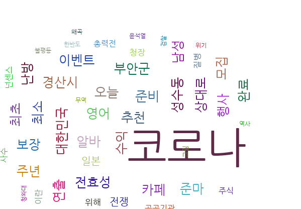

# Twitter_Text_Analysis

## Description
'Twitter_Text_Analysis' 프로젝트는 SNS 데이터를 활용한 연관 분석 프로젝트입니다.

## Motivation
해당 프로젝트를 만들게 된 계기는 데이터 간에 가지는 **관계**를 파악하기 위해서입니다. 연관 분석을 통해, 어떠한 데이터끼리 자주 묶여서 쓰이는 지 확인 할 수 있습니다. 예를 들어, 아래와 같은 마트 구매 기록이 있다고 가정하자.

마트 방문일 | 구매 항목
---|:---:|
1일| 기저귀, 맥주, 우유
5일| 기저귀, 우유 , 빵, 버터, 맥주
10일| 맥주, 빵, 과자, 기저귀
15일| 맥주, 라면 , 기저귀, 우유
20일| 빵, 버터, 콜라, 과자, 우유

해당 표를 통해 알 수 있는 점은, [맥주, 기저귀], [빵, 버터], 등의 상품들이 서로 연관 되어 있는 것을 확인 할 수 있습니다. 이와 같은 데이터를 활용하여서 마트, 슈퍼, 등은 해당 제품들을 가까이 진열해놓게 되면, 고객들이 해당 제품들을 구매하므로써 이윤을 추구 할 있다.


## Contents 
1. 크롤링 모듈
    - 트위터 크롤러
    - 페이스북 크롤러(추가 예정...)
2. 데이터 전처리 과정 
    - 한글을 제외한 나머지 단어 제거
    - 불용어 제거
    - 명사 추출 
2. 워드클라우드 이미지
3. 연관 분석 결과(수정 필요...)

## Requirements
설치해야하는 패키지는 requirements.yml에 명시되어 있습니다.
- matplotlib
- apyori
- konlpy
- networkx
- pytagcloud
- tweepy

## How to run
1. 트위터 데이터를 얻기 위해서는 server_config.json에 자신의 API key를 등록해야 한다.
    - 해당 부분은  https://developer.twitter.com/en/apps 에서 트위터 개발자 회원 가입을 진행하면 됩니다.
2. Crawler/data_synchrnozier.py에 키워드,page 정보를 입력해줍니다. 
    - 아래와 같이 keyword, page을 등록해줍니다.
    - ```python
        synchronizer(keyword='손흥민',pages=100)
        ```
    - 그런 다음, 해당 파이썬 파일을 실행해줍니다.

3. 마지막으로, relation_analyzer.py을 실행하면, Results 폴더 연관분석 결과가 추출됩니다.

## Results
 

